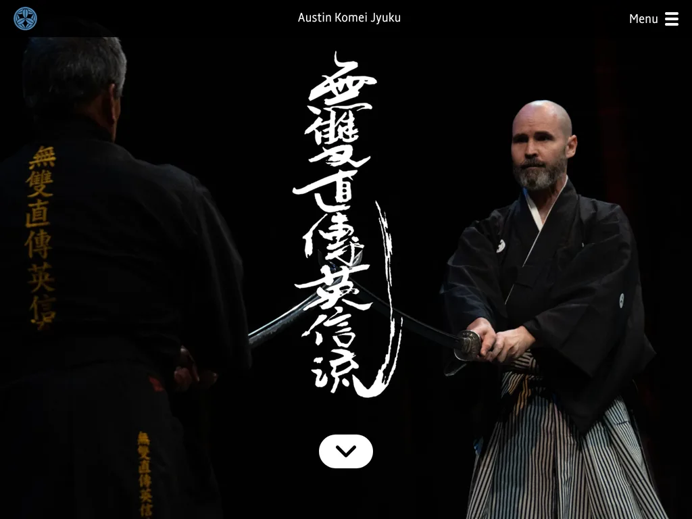

# AKJ Dojo UI

Static marketing site for the Austin Komei Jyuku dojo, built with [Astro 7](https://astro.build/).

> [!NOTE]
> **Live site:** [austin.komeijyuku.com](https://austin.komeijyuku.com/)

---

| Mobile | Desktop |
| :---: | :---: |
|  |  |

---

## Features
- Prerendered static site / SSG using Astro's `output: 'static'`.
- No server, no per-request rendering.
- Vanilla TypeScript adds interactivity to the nav, the parallax hero, and the image gallery.
- 1st-party pages are prefetched in the background when links enter the viewport.
- Deploys as plain HTML, CSS, and JS. No React.

## Prerequisites

- [Install nvm](https://formulae.brew.sh/formula/nvm)
- `nvm use` (for Node **24.18.0**)
- `npm install`
- Playwright's Chromium installs automatically before e2e via the `pretest:e2e` hook, or run
  `npx playwright install chromium` manually. Only needs to be done once.

## Commands

| Command                  | Description                               |
|--------------------------|-------------------------------------------|
| `npm run dev`            | Start the Astro dev server.               |
| `npm run start`          | Alias to dev.                             |
| `npm run build`          | Static production build to `dist/`.       |
| `npm run preview`        | Serve the built `dist/` locally.          |
| `npm run check`          | Type-check with `astro check`.            |
| `npm run test:unit`      | Unit tests (Vitest).                      |
| `npm run test:e2e`       | E2E and a11y tests (Playwright).          |
| `npm test`               | Runs `test:unit` then `test:e2e`.         |
| `npm run coverage`       | Unit tests with V8 coverage.              |
| `npm run lint:style`     | Lint and fix CSS with stylelint.          |
| `npm run prettier:write` | Format `src`, `prettier:check` to verify. |

## Architecture

- **Static, prerendered site.** `output: 'static'` (Astro's default, SSG). One route per file in `src/pages/`, no server.
- **Extensionless URLs.** `build.format: 'file'` emits `iaijutsu.html`, not
  `iaijutsu/index.html`.
- **Layout and SEO.** `StandardLayout.astro` wraps every page and renders `SeoHead.astro`.
- **Scripts.** Uses vanilla TypeScript modules.
- **Imports.** `@/*` aliases `src/*` for cross-folder imports.
- **Styles and assets.** Global styles in `src/styles/`, per-component CSS beside each `.astro`.
  - Autoprefixer (PostCSS) adds vendor prefixes at build from `browserslist`.
  - Files in `public/` copy verbatim into `dist/`.

## Linting and type checking

- Styles: `npm run lint:style`
- TypeScript and Astro: `npm run check`

## Testing

- **Unit.** Vitest (jsdom). Run `npm run test:unit`, or `npm run coverage` for V8 coverage.
- **E2E and a11y.** Playwright drives the site in headless Chromium and runs
  `@axe-core/playwright` checks. Run `npm run test:e2e`.
  - The `pretest:e2e` hook installs Chromium on first run.
- Run both unit and e2e with `npm run test`.

## Deploy

CI/CD via [CircleCI](https://circleci.com/) (`.circleci/config.yml`, image
`cimg/node:24.18.0-browsers`, AWS CLI v2). On push to `master`:

- Runs type checks, unit tests, and e2e tests.
- Runs `.circleci/production.sh` that syncs `dist/` to S3.
- HTML uploads to extensionless keys (`iaijutsu.html` becomes `/iaijutsu`, `index.html` stays at `/`).
- Sets `Cache-Control` `max-age` and CloudFront `s-maxage`.
- CloudFront invalidation on every deploy.

## Documentation

- [docs/BACKLOG.md](docs/BACKLOG.md): deferred follow-ups and their priority.
- [docs/CODE_STYLE.md](docs/CODE_STYLE.md): project structure and code style for Astro and TypeScript.
- [CLAUDE.md](CLAUDE.md): agent instructions and repo conventions.
